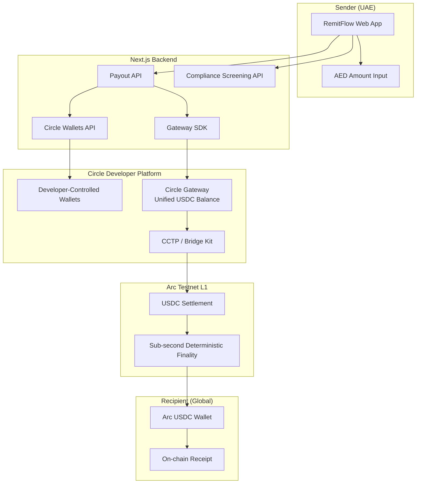

# RemitFlow Architecture

**Track:** Best Cross-Border Payments & Remittances Experience (UAE → Global)  
**Platform:** Arc Testnet (Chain ID `5042002`)  
**Purpose:** Educational and testnet demo only

## System Overview

## Data Flow: UAE → India Remittance

1. **Sender** logs in via Supabase Auth and opens **Send Money**.
2. **Corridor selection** — UAE → destination country (India, Pakistan, Philippines, etc.).
3. **AED input** — converted to USDC at demo rate for fee preview (conceptual "Pay in AED, settle in USDC").
4. **Compliance** — recipient address screened via `/api/compliance/screen`.
5. **Fee breakdown** — platform fee + Arc network fee + CCTP bridge fee displayed transparently.
6. **Payout** — `/api/payout` routes via Circle Gateway unified balance to Arc testnet.
7. **Settlement** — Arc confirms in under 1 second; UI shows real-time settlement tracker.
8. **Receipt** — on-chain confirmation + downloadable remittance receipt in app.

## Circle Products Used

| Product | Role in RemitFlow |
|---------|-------------------|
| **USDC** | Settlement currency on Arc; gas token for predictable fees |
| **Circle Wallets** | Embedded wallet infrastructure for senders/recipients |
| **Circle Gateway** | Unified USDC balance for treasury routing and cross-chain payouts |
| **CCTP / Bridge Kit** | Cross-chain USDC transfers to Arc settlement rail |

## Tech Stack

| Layer | Technology |
|-------|------------|
| Frontend | Next.js 16, React 19, Tailwind CSS, shadcn/ui |
| Backend | Next.js API Routes |
| Database | Supabase (auth, wallets, transactions) |
| Blockchain | Arc Testnet, Circle Developer-Controlled Wallets SDK |
| Cross-chain | `@circle-fin/bridge-kit`, Gateway SDK |

## Base Project

RemitFlow extends [circlefin/arc-fintech](https://github.com/circlefin/arc-fintech) with UAE remittance corridors, AED UX, fee transparency, and settlement tracking.

## Deployment

- **Frontend/Backend:** Vercel or similar Node.js host
- **Database:** Supabase Cloud
- **Secrets:** `CIRCLE_API_KEY`, `CIRCLE_ENTITY_SECRET`, Supabase keys via environment variables